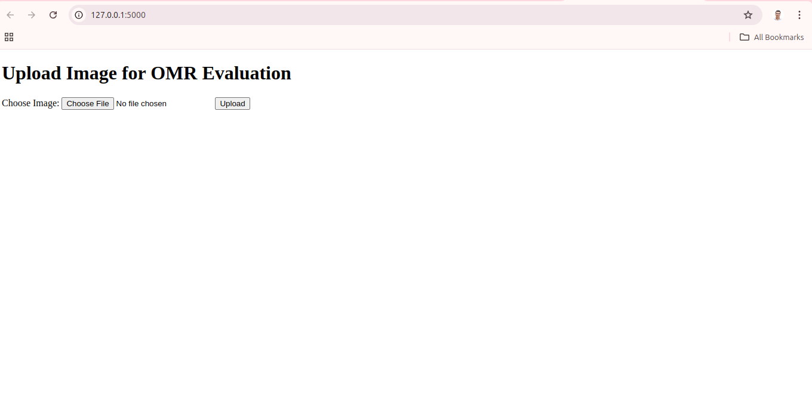
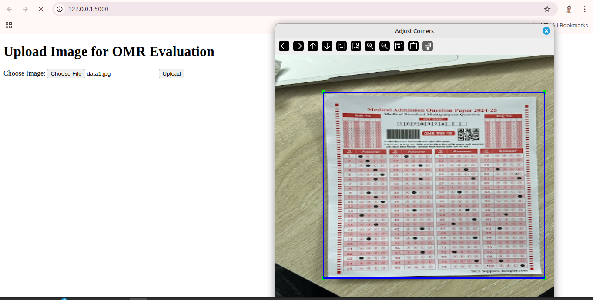
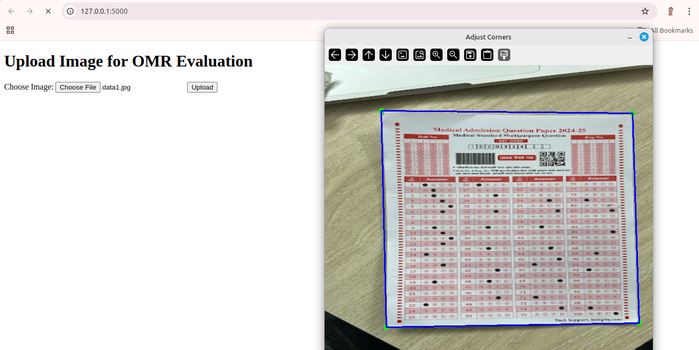
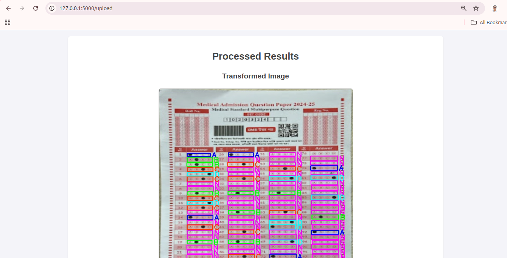
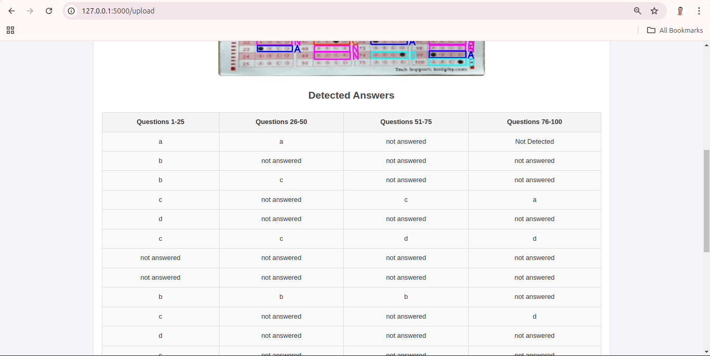
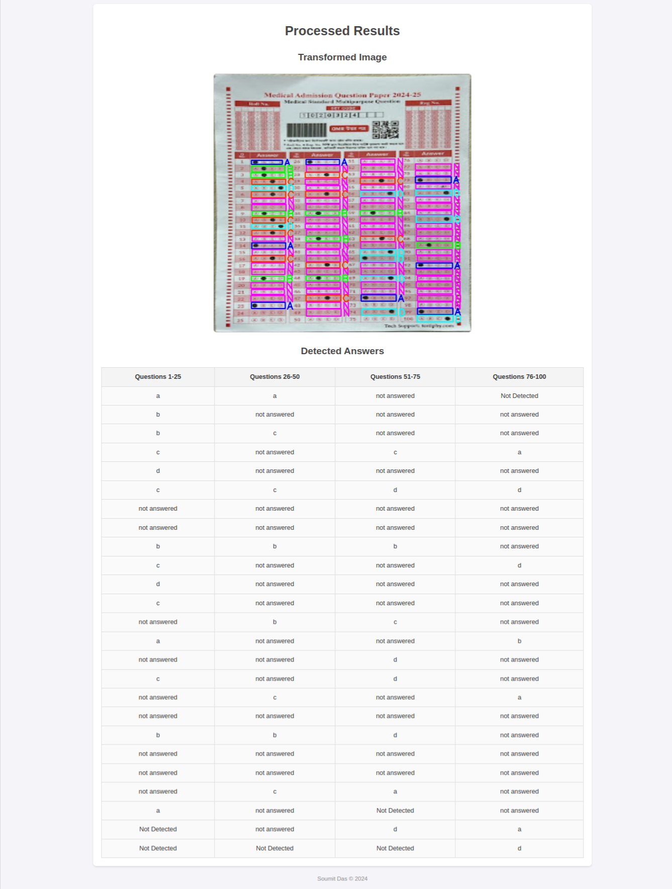

# OMR Evaluation

## Author Information
**Soumit Das**

[](mailto:soumitdas0410@gmail.com)

## Project Overview
This project evaluates Optical Mark Recognition (OMR) sheets using Python, HTML, and CSS. Hosted on a Flask-based website, users can upload images of OMR sheets, which are then processed to detect and evaluate marked answers accurately. The core processing involves perspective transformation using YOLOv11 segmentation,Contour detection; then, answer-box detection using YOLOv11 object detection models. The project utilizes K-means clustering for precise answer box positioning. With further sorting and some more use of algorithms the final evulation has been derived.

The accuracy could improve if the models were trained on a larger dataset, including images that are more similar to the ones used in the experiment.

## Technologies Used
- **Languages**: Python, HTML, CSS
- **Libraries**: OpenCV, Ultralytics, Roboflow

## Models
- **YOLO11n.pt**: For answer detection.
- **YOLO11n-seg.pt**: For OMR sheet segmentation and perspective transformation.
- **K-means**: For clustering answer boxes by row.

## Dataset Sources
1. **Answer Box Detection**: [OMR Scanner Dataset](https://universe.roboflow.com/sust-9qaee/omr-scanner/dataset/7)
2. **OMR Sheet Segmentation**: [Document Segmentation V2 Dataset](https://universe.roboflow.com/lung-x8el1/document-segmentation-v2-gt86h/dataset/2)
3. **Test Data**: Provided by **RubizCode**.

## OMR Sheet Upload and Processing Workflow

### Step 1: Upload OMR Sheet Image
Users upload an image of the OMR sheet via the website interface.
 


### Step 2: Segmentation and Initial Bounding Box
The uploaded image is segmented to isolate the OMR sheet. An initial bounding box is drawn around the segmented sheet, which users can adjust for accuracy.



### Step 3: Adjust Bounding Box Corners
Users manually adjust the bounding box corners to ensure precise coverage of the OMR sheet. It is done because the bounding box is a rectangle where the OMR sheet might not be a perfect rectangle.



### Step 4: Perspective Transformation
The adjusted image undergoes perspective transformation to ensure the OMR sheet is vertically aligned. This process involves:

1. **Finding the Contour**: Using the segmentation mask, the contour of the OMR sheet is detected.
2. **Calculating the Transform Matrix**: The transformation matrix is computed using `cv2.getPerspectiveTransform`.
3. **Applying the Transformation**: The perspective transformation is applied using `cv2.warpPerspective`.

This results in a vertically aligned image of the OMR sheet, making it easier for subsequent processing steps.

### Step 5: Answer Box Detection
The transformed image is first converted to grayscale for better detection, as the training dataset consisted of grayscale images. The grayscale image is then processed by the YOLOv11 model, which detects and provides bounding boxes for almost each answer box.

### Step 6: Answer Derivation through Clustering

#### Clustering by Rows
Answer boxes are clustered using **K-means** clustering based on their y-coordinates, resulting in 25 (number of rows = 25) clusters (one per row). The clusters are **sorted** by the y-coordinate of their centers.

- **Cluster Example**:
  - **Cluster 0**: First row - (answer box, answer box, answer box, answer box)
  - **Cluster 1**: Second row - (answer box, answer box, answer box, answer box)
  - ...

### Overlap Suppression Based on Confidence
In each cluster, if two bounding boxes have an Intersection over Union (IoU) greater than a predefined threshold, they are considered overlapping. In cases of overlap, the bounding box with the higher confidence score is retained, while the one with the lower confidence is discarded.
#### Calculating Column Ranges (Slots)
Column ranges are calculated using the x-coordinates of answer boxes within each cluster.

- **Column Calculation**:
  - `x_left_first_column` = mean(top left x-coordinates of each cluster[0])
  - `x_right_first_column` = mean(bottom right x-coordinates of each cluster[0])
  - `x_left_second_column` = mean(top left x-coordinates of each cluster[1])
  - `x_right_second_column` = mean(bottom right x-coordinates of each cluster[1])
  - Repeat for subsequent columns.

### Step 7: Determine Final Result
For each answer box, the row is already determined. Using the column ranges, the exact column for each answer box is identified based on its x-coordinate.

- **Answer Number Calculation**:
  - `answer_number = column_number * total_rows + row_number + 1`

### Final Result
The final result, showing the detected answers on the perspective-transformed OMR sheet, is displayed.





## Installation

### Prerequisites
- Python 3.12.7
- pip (Python package installer)

### Libraries
Install the required libraries using pip:
```bash
pip install ultralytics roboflow flask opencv-python scikit-learn
```

## Usage

1. **Clone the Repository**
   ```bash
   git clone https://github.com/soumit1803063/omr-evaluation.git
   cd omr-evaluation
   ```

2. **Run the OMR Evaluation Script**
   ```bash
   python omr_evaluation.py
   ```

## Acknowledgements
- Roboflow for providing the datasets.
- Ultralytics for the YOLO models.
- OpenCV for image processing functionalities.
